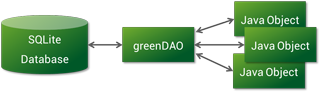
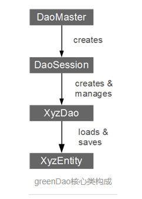
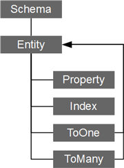

## greenDAO 
&emsp;&emsp;首先可以去它的[官网](http://greenrobot.org/greendao/)，它的英文全称是Object Relational Mapping，意思是对象关系映射。 
 

### 优点
- 效率很高，插入和更新的速度是sqlite的2倍，加载实体的速度是ormlite的4.5倍。官网测试结果：[http://greendao-orm.com/features/](http://greendao-orm.com/features/)
- 文件较小（<100K），占用更少的内存 ，但是需要create Dao，
- 操作实体灵活：支持get，update，delete等操作
- 使用过GreenDao的同学都知道，3.0之前需要通过新建GreenDaoGenerator工程生成Java数据对象（实体）和DAO对象，非常的繁琐而且也加大了使用成本。**GreenDao3.0**最大的变化就是采用注解的方式通过编译方式生成Java数据对象和DAO对象。

### 不足
- 学习成本较高。其中使用了一个Java工程根据一些属性和规则去generate一些基础代码，类似于javaBean但会有一些规则，另外还有QueryBuilder、Dao等API，所以首先要明白整个过程，才能方便使用。没有ORMLite那样封装的完整，不过greenDao的官网上也提到了这一点，正是基于generator而不是反射，才使得其效率高的多。 
 
### 使用

#### 主要核心类：  

    buildscript {
		repositories {
        	jcenter()
    	}
    	dependencies {
        	classpath 'com.android.tools.build:gradle:2.3.3'
        	classpath 'org.greenrobot:greendao-gradle-plugin:3.2.2'//for greeDAO
    	}
	}

**build.gradle**  
`apply plugin: 'org.greenrobot.greendao'`  

	dependencies {
    	compile fileTree(dir: 'libs', include: ['*.jar'])
    	compile 'org.greenrobot:greendao:3.2.2'
	}

  

#### 升级数据库  
&emsp;&emsp;默认生成的DaoMaster.OpenHelper在碰到数据库升级的时候会删除旧的表来创建新的表，这样就会导致旧表的数据全部丢失了，所以一定要封装DaoMaster.OpenHelper来实现数据库升级。  
&emsp;&emsp;示例：  
  
	public class THDevOpenHelper extends DaoMaster.OpenHelper {
    	public THDevOpenHelper(Context context, String name, SQLiteDatabase.CursorFactory factory) {
        	super(context, name, factory);
    	}

    	@Override
    	public void onUpgrade(SQLiteDatabase db, int oldVersion, int newVersion) {
        	switch (oldVersion) {
            	case 1:
                //创建新表，注意createTable()是静态方法
                // SchoolDao.createTable(db, true);     

                // 加入新字段
                // db.execSQL("ALTER TABLE 'moments' ADD 'audio_path' TEXT;");  

                // TODO
                break;
        	}
    	}
	}

#### session缓存
&emsp;&emsp;在同一个session中如果一个entities已经被session记录那么下一次再次操作该实体时，greenDao会先从内存中查找，如果内存中没有再去数据库中查找。这样一方面就极大的提高greenDao的查询效率，另一方面也是需要特别注意的是当entities更新过 greenDao仍然会从内存中取出旧值，所以**如果entities更新过，需要去调用daoseesion.clear()方法清除缓存后才能查到最新值，否则查询到的将还是保存在内存中的值**。  
&emsp;&emsp;有两种清除缓存的方法：  
&emsp;&emsp; - `daoSession.clear();`  
&emsp;&emsp; - `projectDao.detachAll();`  

#### 多表关联
&emsp;**1、1:1关联**   
&emsp;&emsp;**@ToOne** 定义了一个entities与另一个entities的1：1对应关系。通过joinProperty参数来定义一个外键。  
&emsp;**2、1:N关联**   
&emsp;&emsp;**@ToMany** 定义了一个entities(这个标记为源实体)与另一个entities(这个标记为目标实体)的多个对象的关联关系：@Tomany有一下三种方式来定义1：N的映射关系。  
&emsp;&emsp; 1. **referencedJoinProperty**：在目标实体中我们需要定义一个与源实体关联起来的外键  
&emsp;&emsp; 2. **joinProperties**：这个参数是referencedJoinProperty 参数的升级版  
&emsp;&emsp; 3. **@JoinEntity**：定义了N：M的映射关系。  
&emsp;**3、关联表的更新与解析**   
&emsp;&emsp;关联的查询也是懒加载机制，而且查询的结果会保存在缓存中下一次查询的时候如果缓存有会直接从缓存中获取结果。  
&emsp;&emsp;同样关联表更新时因为有缓存机制的存在你需要将改动的表手动的通过add()方法来更新关联表中的对象或者直接清除缓存。  
#### 多表查询
&emsp;**1、关联单个表**  

      //查询地址是住在迪拜大楼的用户  
      QueryBuilder<User> queryBuilder = userDao.queryBuilder();  
      queryBuilder.join(Address.class, AddressDao.Properties.userId).where(AddressDao.Properties.Street.eq("迪拜大楼"));  
      List<User> users = queryBuilder.list();  

通过queryBuilder.join()方法即可完成，其用法也很简单第一个参数是关联的类，第二个是关联类中的关联属性。	  

&emsp;**2、关联多个表**    
 
    //查询在欧洲人口超过100000的城市
    QueryBuilder qb = cityDao.queryBuilder().where(Properties.Population.ge(1000000));
    Join country = qb.join(Properties.CountryId, Country.class);
    Join continent = qb.join(country, CountryDao.Properties.ContinentId,
    Continent.class, ContinentDao.Properties.Id);
    continent.where(ContinentDao.Properties.Name.eq("Europe"));
    List<City> bigEuropeanCities = qb.list();  

通过queryBuilder.join()链式调用来实现多表查询  
**注意：**多表查询的前提是我们已经定义好了外键来关联表与表之间的关系。
#### 自定义参数类型  

1. 默认类型参数 ：greenDao默认支持的类型参数如下  

   	    boolean, Boolean
    	int, Integer
    	short, Short
    	long, Long
    	float, Float
    	double, Double
    	byte, Byte
    	byte[]
    	String
    	Date
 	

2. 自定义类型参数： 如果greenDao的默认参数类型满足不了你的需求，比如你想定义一个颜色属性，那么你可以使用数据库支持的原生数据类型通过PropertyConverter类转换成你想要的颜色属性。   
	- 首先你需要给自定义类型参数添加 @Convert注释并添加对应参数
 	converter：参数转换类，columnType：在数据库中对应的类型
	- 实现PropertyConverter类

### 多线程同步机制  
  
	 //获取当前线程id
     long threadId = Thread.currentThread().getId();
     //加锁
     synchronized (queriesForThreads) {
        //queryRef是一个Map集合
        WeakReference<Q> queryRef = queriesForThreads.get(threadId);
        Q query = queryRef != null ? queryRef.get() : null;
        if (query == null) {
            gc();
            query = createQuery();
            //保存query
            queriesForThreads.put(threadId, new WeakReference<Q>(query));
         } else {
             System.arraycopy(initialValues, 0, query.parameters, 0, initialValues.length);
         }
          return query;
      }

