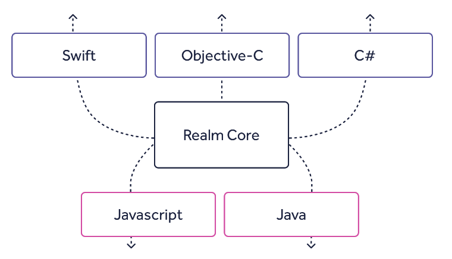

## Realm 
Realm是一个 MVCC 数据库 ，开始是用 C++ 编写的。MVCC 指的是多版本并发控制。[DOC](https://realm.io/docs/ "DOC")  

### Realm的优点
- 采用了 零拷贝 架构
- Realm 的核心是用非常快的 C++ 写的，它把 C++ 对象映射到磁盘上。
- 简单易用速度快跨平台高级功能可视化开源
- 以二叉树结构存储数据
- 支持加密，格式化查询，流式API，JSON，数据变更通知等等。
- 官方提供了一个名为「Realm Browser」轻量级的数据库查看工具(目前还只支持macOS平台)
- Realm是作为一个Gradle插件安装的。
- 对于底层数据而言，RealmObject是实时的，自动更新的

### Realm的不足
- **体积**：引入Realm之后，在不做任何处理的情况下，APK体积增大了几M。
- **数据类型**：Realm要求当前Bean对象必须直接继承RealmObject，侵入性非常强。使用RealmList时，泛型T类型必须是直接继承了RealmObject的类型
- Realm是不支持主键自增长的，所以，我们需要自己维护一个PrimaryKey来约束主键。
- **线程限制**：如果你在UI线程获取到了当前Realm对象，在异步线程中使用当前Realm对象进行操作，就会抛出异常了。RealmObject也是如此。所以，异步很重要。
另外，在调用了Realm.close()方法之后，所获取的对象就不能再访问了，所以，在获取到了RealmObject之后，官方提供了一个COPYFROMREALM来复制一份实例供我们使用。
- 不支持反向link的查询. (见前面链式查询部分的介绍).
- 不支持级联删除. 即从数据库中删除一个对象的时候, 不会删除其中RealmObject子类或RealmList类型的字段在数据库中对应的数据. Issue #1104, Issue #2717. 这点也可以理解, 因为model之间的关系可能是多对多的. 所以需要实现级联删除的地方需要手动处理.
 

> 为什么 Realm 对象不能在线程间传递？

&emsp;&emsp;这是因为隔离性和数据一致性。  
因为 Realm 是基于零拷贝架构，所有对象是鲜活的而且自动更新。如果 Realm 允许对象可在线程间共享，Realm 会无法确保数据的一致性，因为不同的线程会在不确定的什么时间点同时改变对象的数据。这样数据很快就不一致了。一个线程可能需要写入一个数据而另一个线程也打算读取它，反过来也可能。这很快就会变得有问题了，而且你不能够在相信哪个线程能有正确的数据了。   
&emsp;&emsp;是的，这可以通过许多方法来解决，一个常用的方法就是锁住对象，存储器和访问器。虽然这能工作，但是锁会变成一个头疼的性能瓶颈。除了性能，锁的其他问题也很明显，因为锁 —— 一个长时间的后台写事务会阻塞 UI 的读事务。如果我们采用锁机制，我们会失去太多的 Realm 可提供的速度优势和数据一致性的保证。  
因此，唯一的限制就是 Realm 对象在不同的线程间是不能共享的。如果你需要在另外一个线程中获取同样的数据，你只需要在该线程里面重新查询。或者，更好的方法是，用 Realm 的响应式架构监听变化！记住 - 各个线程的所有对象都是自动更新的 - Realm 会在数据变化时通知你。你只需要对这些变化做出响应就可以了 

### 使用

    buildscript {
		repositories {
        	jcenter()
    	}
    	dependencies {
        	classpath 'com.android.tools.build:gradle:2.3.3'
        	classpath "io.realm:realm-gradle-plugin:3.4.0"//for realm
    	}
	}

**build.gradle**  
`apply plugin: 'realm-android'//for realm`  

	dependencies {
    	compile fileTree(dir: 'libs', include: ['*.jar'])
	}
  
#### 创建Model  
&emsp;&emsp;创建一个User类，需要继承`RealmObject`。支持public, protected和 private的类以及方法  
  
	public class User extends RealmObject {
    	private String name;
    	private int age;

    	public String getName() {
        	return name;
    	}

    	public void setName(String name) {
        	this.name = name;
    	}

    	public int getAge() {
        	return age;
    	}

    	public void setAge(int age) {
        	this.age = age;
    	}
	}  
  
&emsp;&emsp;除了直接继承于`RealmObject来声明` Realm 数据模型之外，还可以通过实现 `RealmModel` 接口并添加 `@RealmClass`修饰符来声明。
  
	@RealmClass
	public class User implements RealmModel {
    	...
	}  
  

- 支持的属性
`boolean`, `byte`, `short`,`int`,`long`,`float`, `double`,`String`, `Date` 和`byte[]`, `RealmObject`,  `RealmList<? extends RealmObject>`
还支持`Boolean`, `Byte`, `Short`, `Integer`, `Long`, `Float` 和 `Double`  
**Tip**：整数类型 `short`、`int` 和 `long` 都被映射到 Realm 内的相同类型（实际上为 `long` ）
  
- `@PrimaryKey`——表示该字段是主键  
- `@Required`——表示该字段非空  
**Tip**：基本数据类型不需要使用注解 `@Required`，因为他们本身就不可为空。    
  
- `@Ignore`——表示忽略该字段   
被添加`@Ignore`标签后，存储数据时会忽略该字段。  
  
- `@Index`——添加搜索索引  
为字段添加搜索索引，这样会使得插入的速度变慢，数据量也变得更大。不过在查询速度将变得更快，建议只在优化读取性能的特定情况时添加索引。  
  
#### 增  
&emsp;&emsp;**写入操作需要在事务中进行**，可以使用`executeTransaction`方法来开启事务。  
> **注意**：如果在UI线程中插入过多的数据，可能会导致主线程拥塞。  
    
- 使用`executeTransaction`方法插入数据  
- 使用`copyToRealmOrUpdate`或`copyToRealm`方法插入数据  
- 上面都是用可`executeTransaction方`法插入数据，还有另一种方法可以用于插入数据  
  ——`beginTransaction`和`commitTransaction`  

> **注意**：在UI和后台线程同时开启创建write的事务，可能会导致ANR错误。为了避免该问题，可以使用`executeTransactionAsync`来实现。
  
- 使用`executeTransactionAsync`
该方法会开启一个子线程来执行事务，并且在执行完成后进行结果通知。  
  
Realm 解析 JSON 时遵循如下规则：    

- 使用包含空值（null）的 JSON 创建对象：
- 对于非必须（可为空值的属性），设置其值为 null；
- 对于必须（不可为空值的属性），抛出异常；
- 使用包含空值（null）的 JSON 更新对象：
- 对于非必须（可为空值的属性），设置其值为 null；
- 对于必须（不可为空值的属性），抛出异常；
- 使用不包含对应属性的 JSON： * 该属性保持不变  
  
#### 查  
&emsp;&emsp;查找操作就比插入方便多了，并不需在事务中操作，直接查询即可。  

- `findAll` ——查询  
> **注意**：RealmResults虽然实现了List接口，不过有很多方法是不能用的。比如add、addAll、remove、clear等，调用后会直接抛异常。  
  
- `findAllAsync`——异步查询  
- `findFirst` ——查询第一条数据  
- 更多查询条件  
  `sum()`：对指定字段求和。  
  `average()`：对指定字段求平均值。  
  `min()`: 对指定字段求最小值。  
  `max()` : 对指定字段求最大值。  
  `count` : 求结果集的记录数量。  
  `findAll()`: 返回结果集所有字段，返回值为RealmResults队列  
  `findAllSorted()` : 排序返回结果集所有字段，返回值为RealmResults队列  
  `between()`, `greaterThan()`,`lessThan()`, `greaterThanOrEqualTo()` & `lessThanOrEqualTo()`  
  `equalTo()` & `notEqualTo()`  
  `contains()`, `beginsWith()` & `endsWith()`  
  `isNull()` & `isNotNull()`  
  `isEmpty()`& `isNotEmpty()`  
  
#### 改  
&emsp;&emsp;**修改也是需要在事务中操作**。  
&emsp;&emsp;使用查询语句得到数据，然后将内容改了即可。  
  
#### 删  
- 使用`deleteFromRealm()`  
- `deleteFromRealm(int index)`  
   
		userList.deleteFirstFromRealm(); //删除user表的第一条数据
		userList.deleteLastFromRealm();//删除user表的最后一条数据
		results.deleteAllFromRealm();//删除user表的全部数据  
  
#### 迁移升级  
&emsp;&emsp;对于Realm来说，数据库升级就是迁移操作，把原来的数据库迁移到新结构的数据库。  
&emsp;&emsp;创建迁移类CustomMigration，需要实现`RealmMigration`接口。执行版本升级时的处理：  
  
	 /**
  	   * 升级数据库
  	   */
 	class CustomMigration implements RealmMigration {
     	@Override
     	public void migrate(DynamicRealm realm, long oldVersion, long newVersion) {
         	RealmSchema schema = realm.getSchema();
         	if (oldVersion == 0 && newVersion == 1) {
             	RealmObjectSchema personSchema = schema.get("User");
             	//新增@Required的id
             	personSchema
                     .addField("id", String.class, FieldAttribute.REQUIRED)
                     .transform(new RealmObjectSchema.Function() {
                         @Override
                         public void apply(DynamicReal
						mObject obj) {
                             obj.set("id", "1");//为id设置值
                         }
                     }).removeField("age");//移除age属性
             oldVersion++;
           }
     	}
 	}  
  
使用Builder.migration升级数据库。当Realm发现新旧版本号不一致时，会自动使用该迁移类完成迁移操作。  
  
### 前人挖坑，后人跳坑  
  
1. RealmObject自带线程保护功能，只能在创建它的线程中访问，在子线程中不能访问  
2. 如果Realm关闭，所有查询得到的RealmObject都不能使用了    
3. 如果想在Realm.close()之后继续操作查询得到的对象，只能复制一份数据传出来   
4. 如果直接修改或删除query得到的数据，必须在transaction中完成...  
5. 对业务代码的侵蚀严重，静态库大  
6. 模糊查询？？