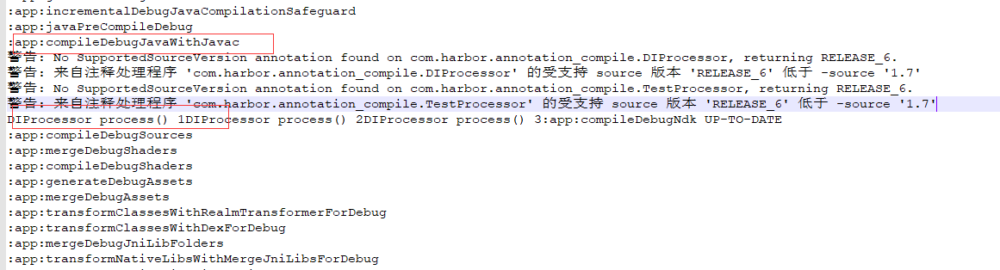
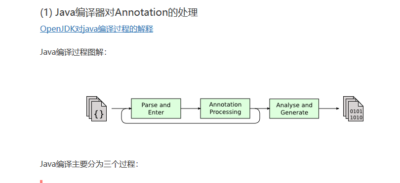
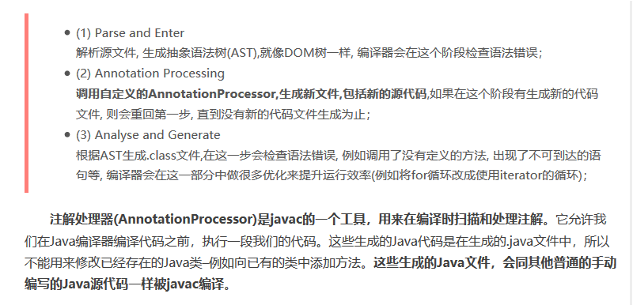
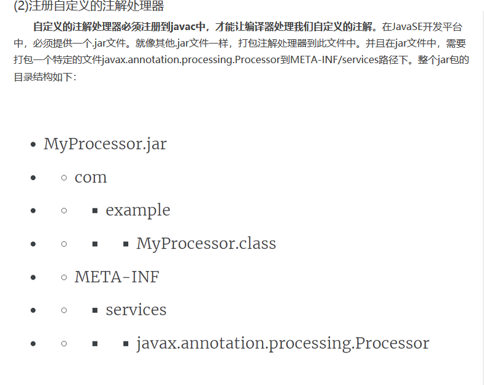
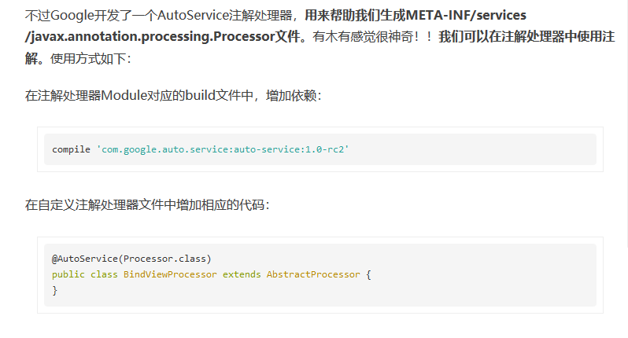

# OrmTest
sample of 
> [greenDAO](http://greenrobot.org/greendao/)
> 
> [ObjectBox](http://objectbox.io/documentation/introduction/)
> 
> [ormlite](http://ormlite.com/)
> 
> [realm](https://realm.io/)  
  
  

----------

    
[Java编译器处理Compilation ](http://openjdk.java.net/groups/compiler/doc/compilation-overview/index.html)  
[中文版](https://caofengbin.github.io/2017/02/16/inside-learn-butter-knife2/)  
  
  
  
  
  
  

  
  
  
  

----------

## screenShot 
 

